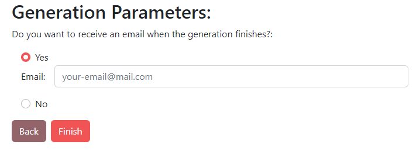

====================
Opciones adicionales
====================

En esta sección te mostraremos las opciones adicionales con las que cuenta la aplicación web.

IP y puerto para la aplicación
------------------------------

Es posible elegir la **ip** y el **puerto** en el que se va a alojar la aplicación.

**Por defecto**, al ejecutar la aplicación, esta se despliega en el ip **localhost** y en el puerto **5000** (http://localhost:5000/). Estos son los parámetros por defecto del **framework** ``Flask <https://flask.palletsprojects.com/en/2.1.x/>``__.

Sin embargo, si deseamos alojar la aplicación en otra dirección o puerto, a la hora de ejecutar la aplicación es posible incluir dos **parámetros de entrada opcionales**:

- La **ip** en la que se desea alojar la aplicación. (Por defecto a localhost / 127.0.0.1)
- El **puerto** en el que localizar la aplicación (Por defecto a 5000).

De esta forma, lanzar la aplicación de la siguiente forma:

- Si se instaló a través de **pip**:
   - ``pymlapigen <IP> <PUERTO>``
   - Ejemplos:
      - ``pymlapigen 0.0.0.0``
      - ``pymlapigen localhost 80``

- Si se **clonó el código fuente**:
   - ``python run.py <IP> <PUERTO>``
   - Ejemplos:
      - ``python run.py 0.0.0.0``
      - ``python run.py localhost 80``

::

    pymlapigen localhost 80
      * Serving Flask app 'pymlapigen' (lazy loading)
      * Environment: production
      * Debug mode: off
      * Running on http://localhost:80/ (Press CTRL+C to quit)

.. _mail:

Servidor de correos elecrónicos (SMTP)
--------------------------------------

La aplicación ofrece **notificaciones** a través de **correo electrónico** para cuando las APIs completan su generación.

Esto es útil para aquellos experimentos en el que los **costes de cómputo** de generación sean **altos** (ya sea por datasets grandes o por algoritmos complicados).

De esta forma, si el usuario **marca** recibir un correo electrónico introduciendo su correo, este será enviado y recibido cuando **finalice la generación** de la API.

El email recibido tiene el siguiente aspecto:

.. image:: _static/mail.png
   :align: center
   :alt: Correo recibido

**IMPORTANTE:** Para poder recibir correos es **necesario** configurar el **servidor de correos electrónicos (SMTP)**. 

Para ello, acceder al fichero de configuración del código fuente *config.py*. En él, debéis **descomentar** e **introducir** los siguientes parámetros:

:MAIL_SERVER: Servidor de correo electrónico. (*String*)
:MAIL_PORT: Puerto de correo electrónico. (*Integer*)
:MAIL_USERNAME: Correo electrónico que enviará los correos. (*String*)
:MAIL_PASSWORD: Contraseña de aplicación del correo electrónico. (*String*)
:MAIL_USE_TLS: Utilizar TLS en los correos electrónicos. (*Boolean*)
:MAIL_USE_SSL: Utilizar SSL en los correos electrónicos. (*Boolean*)

Una vez introducidos estos valores y guardados, al volver a ejecutar la aplicación, la sección de correos electrónicos durante el último paso de la generación deberá aparecer **habilitado**.

Docker
------
La aplicación **es compatible** para ser ejecutada dentro de contenedores con **Docker**.

Para ello:

1. **Clonar el repositorio git** con el comando ``git clone https://github.com/adruizp/PYMLAPIGEN``.

    ::

      git clone https://github.com/adruizp/PYMLAPIGEN
        Cloning into 'PYMLAPIGEN'...
        remote: Enumerating objects: 197, done.
        remote: Counting objects: 100% (197/197), done.
        remote: Compressing objects: 100% (131/131), done.
        Receiving objects:  73% (144/197)), reused 145 (delta 61), pack-reused 0
        Receiving objects: 100% (197/197), 250.51 KiB | 1.25 MiB/s, done.
        Resolving deltas: 100% (104/104), done.

2. Una vez clonado, **acceder** al directorio del proyecto con el comando ``cd PYMLAPIGEN``.
3. Dentro del directorio, crearemos la **imagen Docker** con el comando ``docker build --tag pymlapigen-docker .``

   - Puedes consultar la lista de imagenes con ``docker image ls``. 

::

    docker build --tag pymlapigen-docker .
        [+] Building 71.9s (15/15) FINISHED
        => [internal] load build definition from Dockerfile                                                               0.8s
        => => transferring dockerfile: 215B                                                                               0.0s
        => [internal] load .dockerignore                                                                                  0.8s
        => => transferring context: 2B                                                                                    0.0s
        => resolve image config for docker.io/docker/dockerfile:1                                                         2.0s
        => [auth] docker/dockerfile:pull token for registry-1.docker.io                                                   0.0s
        => CACHED docker-image://docker.io/docker/dockerfile:1@sha256:443aab4ca21183e069e7d8b2dc68006594f40bddf1b15bbd83  0.0s
        => [internal] load .dockerignore                                                                                  0.0s
        => [internal] load build definition from Dockerfile                                                               0.0s
        => [internal] load metadata for docker.io/library/python:3.10.4-slim-buster                                       1.8s
        => [auth] library/python:pull token for registry-1.docker.io                                                      0.0s
        => [1/4] FROM docker.io/library/python:3.10.4-slim-buster@sha256:b59fd1a008ab77d90dca9dffeab9fdcc55475ee78ffa5de  1.7s
        => => resolve docker.io/library/python:3.10.4-slim-buster@sha256:b59fd1a008ab77d90dca9dffeab9fdcc55475ee78ffa5de  0.0s
        => => sha256:b008ef62b91dcc0e4f5f9f6a45b56e4305429afbcfc07f9584b1d0e34776f9e0 3.16MB / 3.16MB                     1.2s
        => => sha256:b59fd1a008ab77d90dca9dffeab9fdcc55475ee78ffa5de3a0097d33936583da 1.86kB / 1.86kB                     0.0s
        => => sha256:5386a4608a2c9339e32683254c9ddff2bccc0f826a96b22deece63b83e9c0384 1.37kB / 1.37kB                     0.0s
        => => sha256:e00cda196d23f412ddd977c38c47b39aafbe156d8fb13d063b7af535ace6678e 7.50kB / 7.50kB                     0.0s
        => => extracting sha256:b008ef62b91dcc0e4f5f9f6a45b56e4305429afbcfc07f9584b1d0e34776f9e0                          0.3s
        => [internal] load build context                                                                                  0.3s
        => => transferring context: 3.26MB                                                                                0.2s
        => [2/4] WORKDIR /pymlapigen                                                                                      0.2s
        => [3/4] ADD . /pymlapigen                                                                                        0.1s
        => [4/4] RUN pip install -r requirements.txt                                                                     61.2s
        => exporting to image                                                                                             3.5s
        => => exporting layers                                                                                            3.4s
        => => writing image sha256:c42e13c735036b785a3e29e600e4d9958af4cdb64e7d8d704dd3d5a2e8dd7aac                       0.0s
        => => naming to docker.io/library/pymlapigen-docker                                                               0.0s

::

    docker image ls
        REPOSITORY          TAG       IMAGE ID       CREATED          SIZE
        pymlapigen-docker   latest    c42e13c73503   57 seconds ago   704MB

5. Con la imagen ya creada, **lanzar un contenedor** con la imagen utilizando el comando ``docker run -d -p <PUERTOMAQUINAHOSPEDADORA>:5000 pymlapigen-docker`` siendo **<PUERTOMAQUINAHOSPEDADORA>** el **puerto** del **equipo hospedador** en el que se desea alojar el contenedor.
  
   - De esta forma, si deseamos alojar el contenedor en el puerto 80, usar el comando ``docker run -d -p 80:5000 pymlapigen-docker``.

::
    
    docker run -d -p 80:5000 pymlapigen-docker
        94543cea3e5e47e9512e81d2a47b0500e8b309a60db23cce75c48eb6ee9bfb15

Una vez seguidos estos pasos, ya tendremos disponible un **contenedor** Docker **ejecutando la aplicación**.

