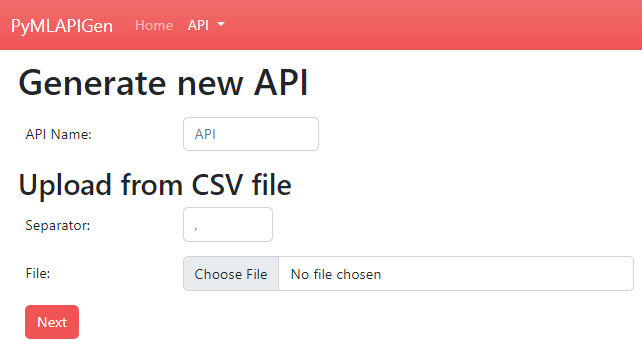
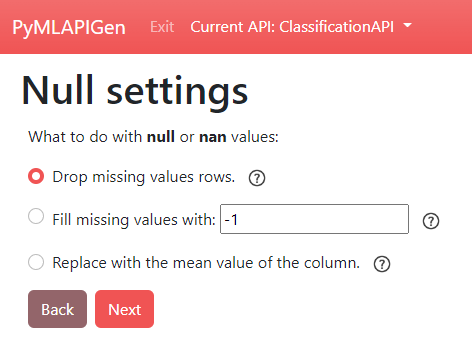
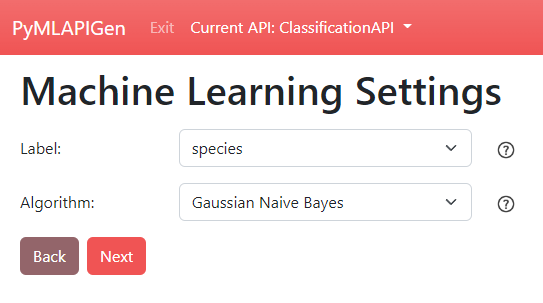
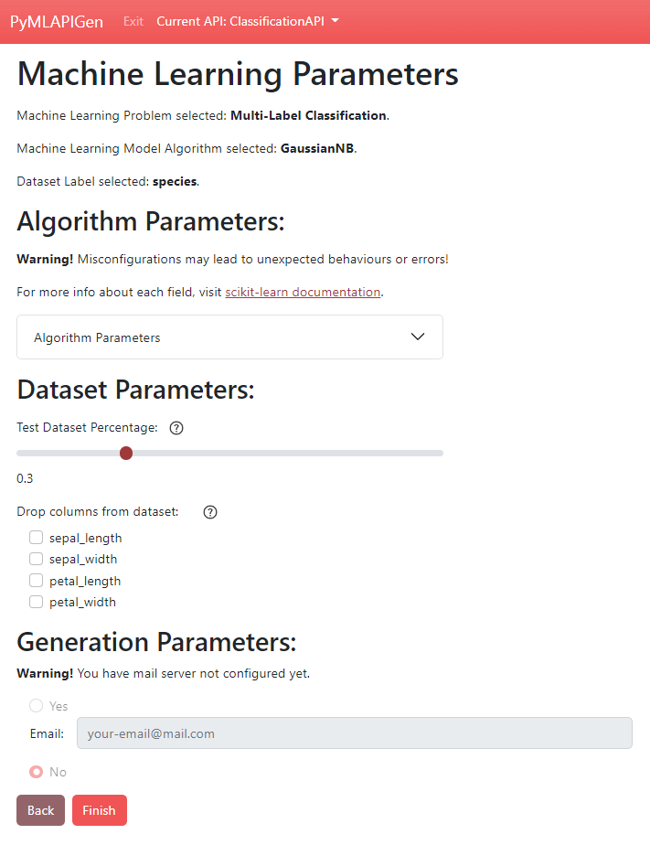

============================
Opciones de generación (WIP)
============================

Paso 1 - Nombre y dataset CSV
-----------------------------

(http://localhost:5000/load/0)
 
En este paso se debe escoger el **nombre** de la API que se va a generar y el dataset del experimento.

Los campos del formulario de este paso son los siguientes:

:API Name: **Nombre** de la API a generar. Todas las rutas de la API tendrán el prefijo */nombre/*. El nombre debe ser único y diferente a "api".
:Separator: **Separador** de valores del fichero CSV. Normalmente suele ser "," aunque puede variar en función del fichero.
:File: **Fichero CSV** que contiene el **dataset** del experimento.

Paso 2 - Ajustes de valores nulos
---------------------------------

(http://localhost:5000/NOMBREAPI/load/1)

En este paso se debe escoger el **procesado** de los valores **nulos** y **NaN**. Es decir, se decide que hacer con aquellos valores que faltan del dataset.

Se debe elegir entre las siguientes **opciones**:

:Drop missing values rows: Esta opción **desecha** del dataset subido aquellas fillas con valores nulos o NaN.
:Fill missing values with <valor>: Esta opción **rellena** los valores nulos o NaN con el **valor fijo** introducido.
:Replace with the mean value of the column: Esta opción **rellena** los valores nulos o NaN con el valor numérico **medio** de la columna o el valor discreto **más frecuente**.

Paso 3 - Ajustes de Machine Learning
------------------------------------

(http://localhost:5000/NOMBREAPI/load/2)

En este paso se debe escoger la **etiqueta**/**columna objetivo** de los experimentos de **clasificación** y **regresión** y el **algoritmo** que ejecutará el modelo.

Al seleccionar el algoritmo, también se selecciona el tipo de experimento (**clasificación**, **regresión** o **clustering**).

Los campos del formulario de este paso son los siguientes:

:Label: **Nombre** de la **columna objetivo**/**etiqueta**. Disponible para **experimentos supervisados** (clasificación o regresión).
:Algorithm: **Algoritmo** que ejecutará **el modelo** del experimento. Al elegir un algoritmo se elige también el **tipo de experimento** (**clasificación**, **regresión** o **clustering**).

Paso 4 - Parámetros del experimento
-----------------------------------

(http://localhost:5000/NOMBREAPI/load/3)

En este paso se debe escoger los diferentes **parámetros adicionales** del experimento y de la API a generar

Los campos del formulario de este paso son los siguientes:

:Positive label: Valor de etiqueta **positiva**. Utilizado para calcular los **falsos negativos**, **falsos positivos**, **verdaderos negativos**, **verdaderos positivos** durante la fase de test. **(Únicamente disponible para experimentos de clasificación binaria)** 
:Algorithm Parameters: **Parámetros** concretos del algoritmo. Cada algoritmo tiene sus parámetros ajustables propios. Para saber más de cada parámetro visitar la documentación de la librería `Scikit-Learn <https://scikit-learn.org/stable/>`__.
:Test Dataset Percentage: **Porcentaje** del dataset que se dedicará a formar el conjunto de entrenamiento para la fase de **entrenamiento**. Por defecto a 0.3. **(Únicamente disponible para experimentos de clasificación y regresión)** 
:Drop columns from dataset: **Atributos** del dataset que no se desean conservar. Aquellas columnas seleccionadas serán desechadas del dataset.
:Email: Si se ha configurado el :ref:`mail`, en esta opción podrás seleccionar si recibir o no un **correo electrónico** una vez **finalice** la **generación de la API**.

Endpoint JSON POST
------------------
Es posible generar una API desde una petición **HTTP POST** al endpoint (**/api/load**).

El cuerpo de la petición POST será un **objeto JSON**. Los atributos de este objeto serán:

:apiName: **Nombre** de la API a generar. Todas las rutas de la API tendrán el prefijo */nombre/*. El nombre debe ser único y diferente a "api". **Obligatorio**.
:dataset: **Dataset** del experimento. Consiste en un array de JSON cuyos elementos son objetos JSON con los atributos. **Obligatorio**.
:modelType: **Algoritmo** del modelo experimento. En función del algoritmo se elige también el tipo de experimento (**clasificación**, **regresión** o **clustering**).. **Obligatorio**. Los algoritmos disponibles son:

    - **Clasificación**
       - **GNB** - *Gaussian Naive Bayes*
       - **SVC** - *Support Vector Machine*
       - **KNN** - *K-Neighbors Classifier*
       - **DT** - *Decision Tree Classifier*
       - **RF** - *Random Forest Classifier*
    - **Regresión** 
       - **LR** - *Linear Regression*
       - **SVR** - *Support Vector Machine*
       - **SGDR** - *SGD Regressor*
       - **KR** - *Kernel Ridge*
       - **GBR** - *Gradient Boosting Regressor*
    - **Clustering** 
       - **KM** - *K-Means*
       - **AP** - *Affinity Propagation*
       - **MS** - *Mean Shift*
       - **MKM** - *Mini-Batch K-Means*

:nanNullMode: **Modo de procesado** de los valores nulos. **Optativo**. Las opciones son:

    - **drop** - Deshechar filas con valores nulos. **(Opción por defecto si no se especifica)**
    - **fill** - Rellenar con un valor fijo. Si elige esta opción, se **debe proveer** el atributo **fillvalue**.
    - **mean** - Rellenar con la media o moda.

:fillvalue: **Valor fijo** a rellenar. **Obligatorio si nanNullMode : "fill"**.

:modelParams: **Objeto JSON** con los **parámetros concretos** del algoritmo (visitar la documentación de la librería `Scikit-Learn <https://scikit-learn.org/stable/>`__). **Optativo**.
:dropColumns: **Array JSON** con los **Atributos** del dataset que no se desean conservar. Aquellas columnas seleccionadas serán desechadas del dataset. **Optativo**.
:testSize: **Porcentaje** del dataset que se dedicará a formar el conjunto de entrenamiento para la fase de **entrenamiento**. Por defecto a 0.3. **(Únicamente disponible y optativo para experimentos de clasificación y regresión)**
:Positive label: Valor de etiqueta **positiva**. Utilizado para calcular los **falsos negativos**, **falsos positivos**, **verdaderos negativos**, **verdaderos positivos** durante la fase de test. **(Únicamente disponible y obligatorio para experimentos de clasificación binaria)** 
:email: Si se ha configurado el :ref:`mail` y se desea recibir un correo electrónico una vez finalice la generación de la API, especifica el **email** que **recibirá el correo**. **Optativo**

Una vez se realice la petición HTTP POST, la aplicación retornará un mensaje de **éxito** (junto a los endpoints generados) o **error** en función del resultado de la operación.