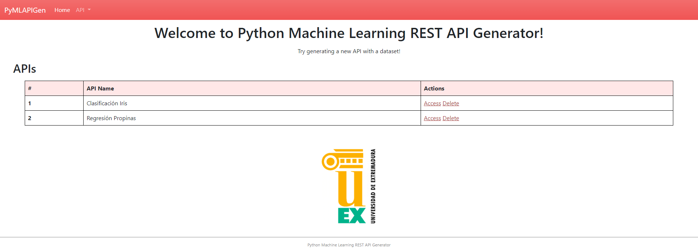

===========
Instalación
===========

En esta sección se te mostrará como instalar la aplicación en
diferentes sistemas operativos.

Software necesario
------------------

Para poder ejecutar la aplicación, es necesario que tengas en tu equipo
instalado el software `Python <https://www.python.org>`__.

Descargar y ejecutar herramienta
--------------------------------

Una vez instalado todo el software necesario, es momento de descargar la herramienta e iniciarla.

Esto es posible de dos formas:

- **Instalar** y **utilizar** la aplicación a través de **pip** y la **línea de comandos**.

 1. Abrir una terminal/consola.
 2. Ejecutar el comando ``pip install git+https://github.com/adruizp/PYMLAPIGEN`` para descargar la herramienta y las librerías necesarias.
 3. Iniciar la aplicación con el comando ``pymlapigen``

    ::

      pymlapigen
        * Serving Flask app 'pymlapigen' (lazy loading)
        * Environment: production
        * Debug mode: off
        * Running on http://127.0.0.1:5000/ (Press CTRL+C to quit)

 4. Acceder al URL http://localhost:5000

- **Clonar**, **instalar** y **ejecutar** el repositorio de la aplicación.

 1. Abrir una terminal/consola en el directorio que se desee descargar la aplicación.
 2. Ejecutar el comando ``git clone https://github.com/adruizp/PYMLAPIGEN`` para clonar el repositorio que contiene la herramienta.

    ::

      git clone https://github.com/adruizp/PYMLAPIGEN
        Cloning into 'PYMLAPIGEN'...
        remote: Enumerating objects: 197, done.
        remote: Counting objects: 100% (197/197), done.
        remote: Compressing objects: 100% (131/131), done.
        Receiving objects:  73% (144/197)), reused 145 (delta 61), pack-reused 0
        Receiving objects: 100% (197/197), 250.51 KiB | 1.25 MiB/s, done.
        Resolving deltas: 100% (104/104), done.

 3. Acceder al directorio de la aplicación con el comando ``cd PYMLAPIGEN``
 4. Instalar las librerías necesarias con el comando ``pip install -r requirements.txt``
 5. Iniciar la aplicación con el comando ``python run.py``

    ::

      python run.py
        * Serving Flask app 'pymlapigen' (lazy loading)
        * Environment: production
        * Debug mode: off
        * Running on http://127.0.0.1:5000/ (Press CTRL+C to quit)

 6. Acceder al URL http://localhost:5000

Acceder a la herramienta
------------------------

Una vez inicializada la herramienta, es posible acceder a ella, ya sea:

- A través de un navegador web (ruta http://localhost:5000)

- A través de una petición GET al endpoint http://localhost:5000/api/.

  ::

    curl http://localhost:5000/api/
      {"status":"Api is working"}