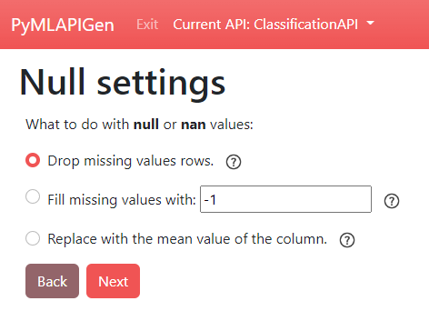
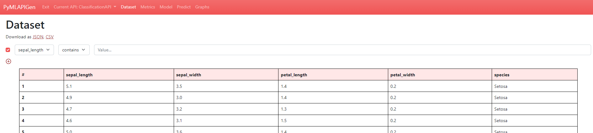
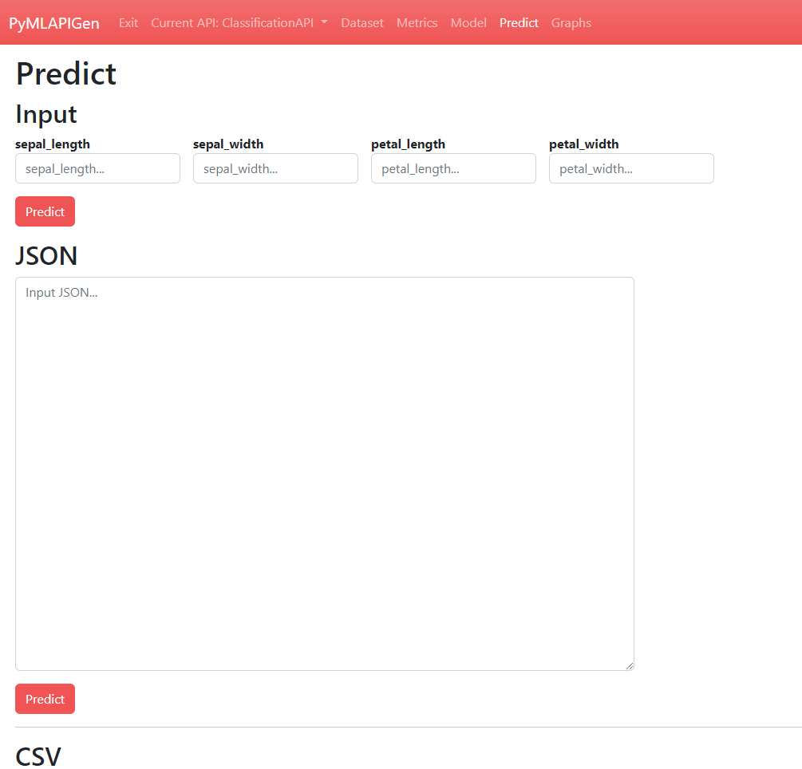

===================
Clasificación (WIP)
===================
En este apartado se mostrará un ejemplo de uso de la aplicación para **generar una API** con un experimento de **clasificación**.

En el dominio de Machine Learning, la **clasificación** es un tipo de aprendizaje **supervisado**. El valor que se quiere predecir
es una clase dentro de un **número discreto** de **clases**. 

Si se intenta predecir entre dos clases se trata de una **clasificación binaria**
mientras que si el número de clases posibles es superior a dos se trata de una **clasificación multiclase**.

.. _dataset:

Dataset
-------
El dataset que se va a utilizar para este ejemplo práctico consiste en un conjunto de datos de **flores iris**.

Este dataset es **público** y tiene un formato **CSV**. Puede descargarlo :download:`pulsándo aqui <../../_static/iris.csv>`.

Las columnas de este dataset son las siguientes:

:sepal_length: **Atributo** que indica la longitud del sépalo. (*Float*)
:sepal_width: **Atributo** que indica la anchura del sépalo. (*Float*)
:petal_length: **Atributo** que indica la longitud del petalo. (*Float*)
:petal_width: **Atributo** que indica la anchura del petalo. (*Float*)
:species: **Etiqueta**/**Clase** a predecir. Representa la **especie** de la flor. (*String*)

::

    "sepal_length","sepal_width","petal_length","petal_width","species"
    5.1,3.5,1.4,.2,"Setosa"
    4.9,3,1.4,.2,"Setosa"
    4.7,3.2,1.3,.2,"Setosa"
    4.6,3.1,1.5,.2,"Setosa"
    ...

Generar API (Herramienta Web)
-----------------------------
En primer lugar, hay que inicializar la herramienta:

  - Si se instaló como paquete usando el comando ``pymlapigen``.
  - Si se clonó el repositorio con el comando ``python run.py``.

  ::

      * Serving Flask app 'pymlapigen' (lazy loading)
      * Environment: production
      * Debug mode: off
      * Running on http://127.0.0.1:5000/ (Press CTRL+C to quit)

Una vez inicializada la herramienta, acceder a ella a través del URL http://localhost:5000.

.. image:: ../../_static/home.png
   :align: center
   :alt: Aplicacion Web

 

Dentro de la aplicación, para comenzar la generación de la API, desplegar el menú *API* y pulsar sobre *Generate New*.

.. image:: _static/generate.png
   :align: center
   :alt: Aplicacion Web

Paso 1
^^^^^^

En este paso, se debe escoger el **nombre de la API** a generar y el **dataset** del experimento.

Para este ejemplo, introduciremos en el formulario los siguientes valores:

:API Name: *ClassificationAPI*
:Separator: *,*
:File: *Fichero descargado del apartado* `dataset`_

Una vez introducidos los parámetros, presionar el botón **Next**.

Paso 2
^^^^^^

En este paso, se debe escoger **que hacer** con los **valores que faltan** o **NaN** del dataset.

Como en el dataset de este ejemplo todos los valores **están** y son **válidos**, este paso es irrelevante.

Simplemente presionar el botón **Next**.

Paso 3
^^^^^^
.. image:: _static/paso_3_clas.png
   :align: center
   :alt: Paso 3 Clasificación

En este paso, se debe escoger la **etiqueta**/**clase** del dataset a partir del cual se entrenará el modelo para predecir en el experimento de clasificación.

También se debe elegir el **algoritmo** de Machine Learning que llevará a cabo el modelo que se entrenará.

Para este ejemplo, introduciremos en el formulario los siguientes valores:

:Label: *species*
:Algorithm: *Classification > Gaussian Naive Bayes*

Una vez introducidos los parámetros, presionar el botón **Next**.

Paso 4
^^^^^^
.. image:: _static/paso_4_clas.png
   :align: center
   :alt: Paso 4 Clasificación

En este último paso, se deben seleccionar los **parámetros adicionales** del experimento.

Para este ejemplo, se dejarán las **opciones por defecto** y se presiona el botón **Finish** para comenzar la **generación de la API**.

Ventanas API (Herramienta Web)
------------------------------

Una vez se genere la API (entrenamiento y evaluación del modelo) se nos redirigirá a la ventana **HOME** de la API (http://localhost:5000/ClassificationAPI).

En esta ventana podrás acceder a las distintas **rutas** y los diferentes **endpoints** de la API.

Además, en la **barra de navegación** podrás navegar entre las distintas ventanas de la API o salir de ella.

Dataset
^^^^^^^

(http://localhost:5000/ClassificationAPI/dataset)

En esta ventana podrás **visualizar** el dataset del experimento de la API generada.

También puedes **ordenar** la tabla pulsando en las cabeceras y aplicar **filtros**.

Metricas
^^^^^^^^

.. image:: _static/metrics_clas.png
   :align: center
   :alt: Metrics API Clasificación

(http://localhost:5000/ClassificationAPI/metrics)

En esta ventana podrás **visualizar** las métricas del experimento de la API generada.

También puedes **desplegar** y **echar un vistazo** al resultado de la **fase de evaluación** del experimento. En él, puedes ver el **valor original** de la etiqueta/clase, el **valor predicho** y si es **correcto o no**. 

Model
^^^^^

(http://localhost:5000/ClassificationAPI/model)

En esta ventana podrás **visualizar** los parámetros escogidos para el experimento de la API generada.

Predecir
^^^^^^^^

(http://localhost:5000/ClassificationAPI/model)

En esta ventana podrás **realizar predicciones** de nuevos datos TODO!!.

Gráficos
^^^^^^^^

Generar API (Peticion JSON)
-----------------------------
<PONER COMO ENVIAR PETICION JSON>

Peticion JSON (/load)
^^^^^^^^^^^^^^^^^^^^^
<PONER PETICION LOAD>

Endpoints API (Peticiones JSON)
-------------------------------

GET Dataset
^^^^^^^^^^^

GET Metrics
^^^^^^^^^^^

GET Model
^^^^^^^^^

POST Predecir
^^^^^^^^^^^^^
