==========
Clustering
==========

En este apartado se mostrará un ejemplo de uso de la aplicación para **generar una API** con un experimento de **clustering**.

En el dominio de Machine Learning, el **clustering** es un tipo de aprendizaje **no supervisado**. El objetivo es **agrupar** el conjunto de datos en una 
serie de **conjuntos similares** (*clústeres*). 

Dataset
-------
El dataset que se va a utilizar para este ejemplo práctico consiste en un conjunto de datos de **flores iris**.

Este dataset es **público** y tiene un formato **CSV**. Puede descargarlo :download:`pulsándo aqui <../../_static/iris.csv>`.

Las columnas de este dataset son las siguientes:

:sepal_length: **Atributo** que indica la longitud del sépalo. (*Float*)
:sepal_width: **Atributo** que indica la anchura del sépalo. (*Float*)
:petal_length: **Atributo** que indica la longitud del petalo. (*Float*)
:petal_width: **Atributo** que indica la anchura del petalo. (*Float*)
:species: **Atributo** que indica la especie de la flor. (*String*)

En el caso ideal, los conjuntos formados coincidirán con las especies.

::

    "sepal_length","sepal_width","petal_length","petal_width","species"
    5.1,3.5,1.4,.2,"Setosa"
    4.9,3,1.4,.2,"Setosa"
    4.7,3.2,1.3,.2,"Setosa"
    4.6,3.1,1.5,.2,"Setosa"
    ...

Generar API (Herramienta Web)
-----------------------------
En primer lugar, hay que inicializar la herramienta:

  - Si se instaló como paquete usando el comando ``pymlapigen``.
  - Si se clonó el repositorio con el comando ``python run.py``.

  ::

      * Serving Flask app 'pymlapigen' (lazy loading)
      * Environment: production
      * Debug mode: off
      * Running on http://127.0.0.1:5000/ (Press CTRL+C to quit)

Una vez inicializada la herramienta, acceder a ella a través del URL http://localhost:5000.

.. image:: ../../_static/home.png
   :align: center
   :alt: Aplicacion Web

 

Dentro de la aplicación, para comenzar la generación de la API, desplegar el menú *API* y pulsar sobre *Generate New*.

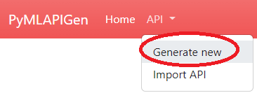

Paso 1
^^^^^^
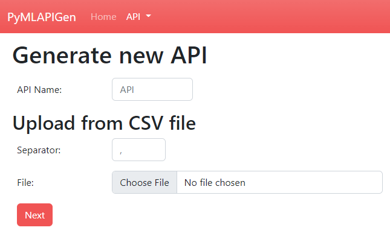

En este paso, se debe escoger el **nombre de la API** a generar y el **dataset** del experimento.

Para este ejemplo, introduciremos en el formulario los siguientes valores:

:API Name: *ClusteringAPI*
:Separator: *,*
:File: *Fichero descargado del apartado* `dataset <#dataset>`_

Una vez introducidos los parámetros, presionar el botón **Next**.

Paso 2
^^^^^^
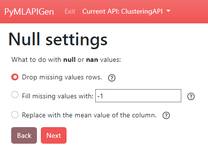

En este paso, se debe escoger **qué hacer** con los **valores que faltan** o **NaN** del dataset.

Como en el dataset de este ejemplo todos los valores **están** y son **válidos**, este paso es irrelevante.

Simplemente presionar el botón **Next**.

Paso 3
^^^^^^
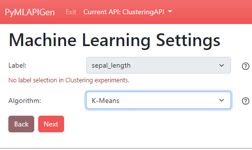

En este paso, se debe escoger el **algoritmo** de Machine Learning que llevará a cabo el modelo que se entrenará.

Al tratarse de un experimento de *clustering*, no hay que seleccionar ninguna **etiqueta**.

Para este ejemplo, introduciremos en el formulario los siguientes valores:

:Algorithm: *Clustering > K-Means*

Una vez introducidos los parámetros, presionar el botón **Next**.

Paso 4
^^^^^^
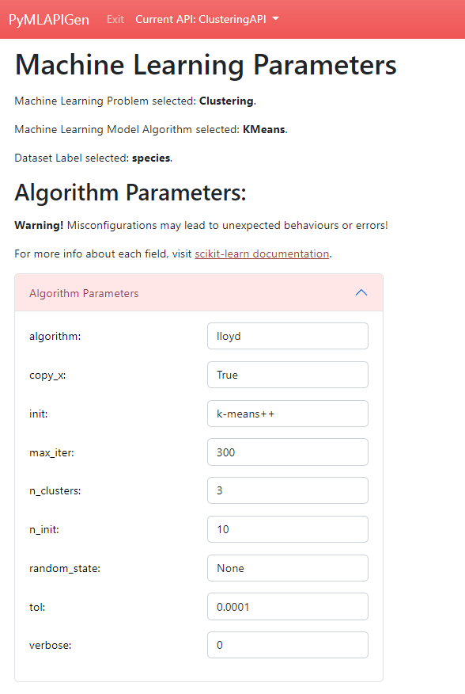

En este último paso, se deben seleccionar los **parámetros adicionales** del experimento.

Como se esta utilizando el algoritmo *K-Means*, seleccionaremos el número de conjuntos (*clusters*) que deseamos que se formen. Se eligirá 3 ya que es el número de especies del dataset.

Para ello, desplegar **Algorithm Parameters** e introducir el valor *3* en *n_clusters*.

El resto de opciones se dejarán las **por defecto** y se presiona el botón **Finish** para comenzar la **generación de la API**.

Ventanas API (Herramienta Web)
------------------------------

Una vez se genere la API (entrenamiento y evaluación del modelo) se nos redirigirá a la ventana **HOME** de la API (http://localhost:5000/ClusteringAPI).

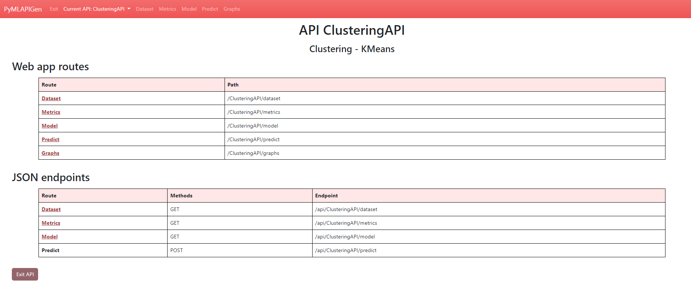

En esta ventana podrás acceder a las distintas **rutas** y los diferentes **endpoints** de la API.

Además, en la **barra de navegación** podrás navegar entre las distintas ventanas de la API o salir de ella.

Dataset
^^^^^^^

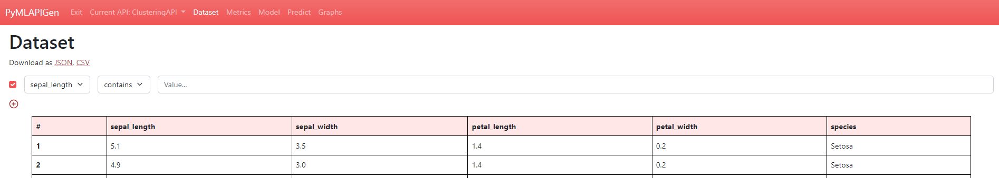

(http://localhost:5000/ClusteringAPI/dataset)

En esta ventana podrás **visualizar** el dataset del experimento de la API generada.

También puedes **ordenar** la tabla pulsando en las cabeceras y aplicar **filtros**.

Métricas
^^^^^^^^

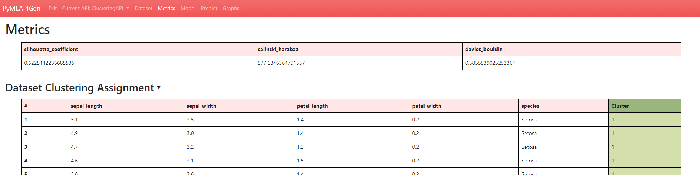

(http://localhost:5000/ClusteringAPI/metrics)

En esta ventana podrás **visualizar** las métricas del experimento de la API generada.

También puedes **desplegar** y **echar un vistazo** al resultado de la **fase de asignación de conjuntos** del experimento. En él, puedes ver el **clúster** al cual se ha **asignado** cada entrada del dataset. Al elegir 3 clústeres en la generación de la API, los tres clústeres generados son 1, 2 y 3.

Model
^^^^^

.. image:: _static/model_clus.png
   :align: center
   :alt: Model API Clustering

(http://localhost:5000/ClusteringAPI/model)

En esta ventana podrás **visualizar** los parámetros escogidos para el experimento de la API generada.

Predecir
^^^^^^^^

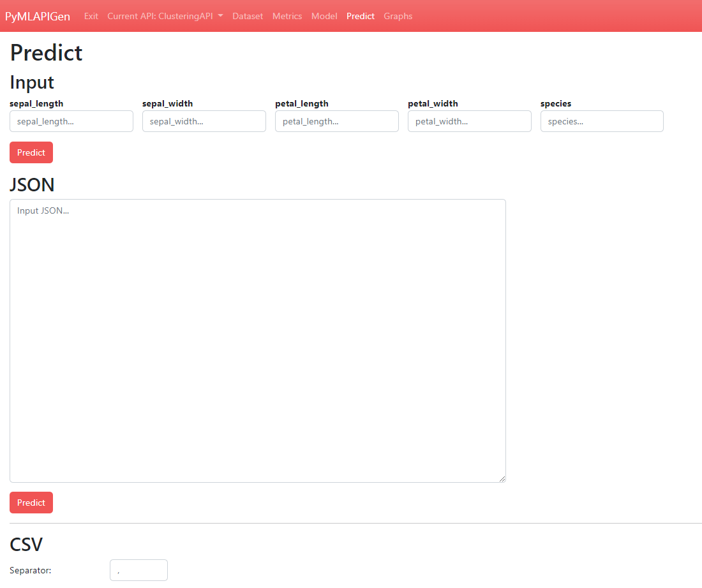

(http://localhost:5000/ClusteringAPI/predict)

En esta ventana podrás realizar **predicciones** utilizando el modelo entrenado del experimento de la API generada.

Puedes realizar las predicciones de diversas formas:
   
   - Introduciendo los datos **manualmente**.
   - Utilizando un objeto **JSON** como parámetro de entrada.
   - A través de un fichero **CSV** de entrada.

Una vez introducidos los datos y pulsado el botón **Predict**, si los datos son correctos y no hay ningún problema, se nos mostrará abajo el resultado de la predicción.

**Por ejemplo**, mandar a predecir el siguiente objeto JSON:

::

   [{
      "sepal_length": 4.9,
      "sepal_width": 3.0,
      "petal_length": 1.4,
      "petal_width": 0.2,
      "species": "Setosa"
   }, {
      "sepal_length": 6.3,
      "sepal_width": 2.7,
      "petal_length": 4.9,
      "petal_width": 1.8,
      "species": "Virginica"
   }, {
      "sepal_length": 4.8,
      "sepal_width": 3.1,
      "petal_length": 1.6,
      "petal_width": 0.2,
      "species": "Setosa"
   }]

El resultado es el siguiente:

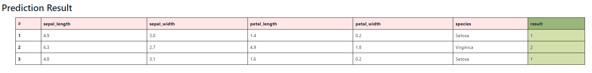

Gráficos
^^^^^^^^

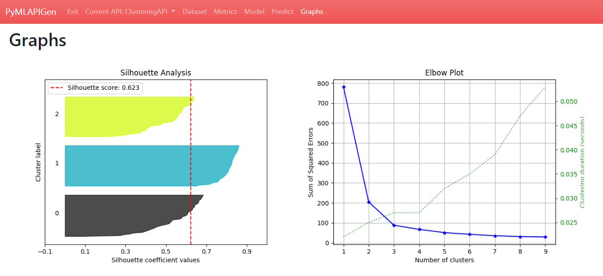

(http://localhost:5000/ClusteringAPI/graphs)

En esta ventana podrás **visualizar** distintos **gráficos** en función del modelo del experimento de la API generada.

Generar API (Petición JSON)
-----------------------------
Además de la aplicación web, es posible generar y utilizar la API a partir de **peticiones JSON** a los endpoints de la aplicación.

Petición JSON (/load)
^^^^^^^^^^^^^^^^^^^^^
Para generar una API equivalente al generado con la aplicación web, se debe enviar una petición **HTTP POST** al endpoint http://localhost:5000/api/load. El cuerpo de esta petición HTTP POST será :download:`este JSON<_static/clustering_quickstart.json>`. 

Si todo funciona correctamente, se nos debería devolver el siguiente resultado de la operación:

::

   {
      "success": "The API has been successfully generated and its now operable.",
      "endpoints": {
         "home": {
            "methods": "GET",
            "endpoint": "/api/ClusteringAPIFromJSON"
         },
         "dataset": {
            "methods": "GET",
            "endpoint": "/api/ClusteringAPIFromJSON/dataset"
         },
         "metrics": {
            "methods": "GET",
            "endpoint": "/api/ClusteringAPIFromJSON/metrics"
         },
         "model": {
            "methods": "GET",
            "endpoint": "/api/ClusteringAPIFromJSON/model"
         },
         "predict": {
            "methods": "POST",
            "endpoint": "/api/ClusteringAPIFromJSON/predict"
         }
      }
   }

Endpoints API (Peticiones JSON)
-------------------------------

GET Dataset
^^^^^^^^^^^

**Endpoint:** http://localhost:5000/api/ClusteringAPIFromJSON/dataset

En este endpoint podrás **consultar** el **dataset** del experimento de la API generada.

Resultado:

::

   [
      {
         "petal_length": 1.4, 
         "petal_width": 0.2, 
         "sepal_length": 5.1, 
         "sepal_width": 3.5, 
         "species": "Setosa"
      }, 
      {
         "petal_length": 1.4, 
         "petal_width": 0.2, 
         "sepal_length": 4.9, 
         "sepal_width": 3.0, 
         "species": "Setosa"
      }, 
      ...   
      {
         "petal_length": 5.1, 
         "petal_width": 1.8, 
         "sepal_length": 5.9, 
         "sepal_width": 3.0, 
         "species": "Virginica"
      }
   ]

GET Metrics
^^^^^^^^^^^

**Endpoint:** http://localhost:5000/api/ClusteringAPIFromJSON/metrics

En este endpoint podrás **consultar** la **evaluación** del experimento de la API generada.

Resultado:

::

   {
      "silhouette_coefficient": 0.369247326698845, 
      "calinski_harabaz": 482.3198481255937, 
      "davies_bouldin": 0.9080585128589639
   }

GET Model
^^^^^^^^^

**Endpoint:** http://localhost:5000/api/ClusteringAPIFromJSON/model

En este endpoint podrás **consultar** los **parámetros del experimento** de la API generada.

Resultado:

::

   {
      "features": [
            "petal_length", 
            "petal_width", 
            "sepal_length", 
            "sepal_width", 
            "species"
      ], 
      "problem": "Clustering", 
      "NanNull": "drop", 
      "dropped": [], 
      "algorithm": "KMeans", 
      "algorithm_args": {}, 
      "dataset_size": 150
   }

POST Predict
^^^^^^^^^^^^^

**Endpoint:** http://localhost:5000/api/ClusteringAPIFromJSON/predict

En este endpoint podrás realizar **predicciones** al experimento de la API generada.

Para ello, en el cuerpo de la petición HTTP POST se introducirá un objeto JSON con los parámetros de entrada.

Por ejemplo se va a mostrar una petición HTTP POST cuyo cuerpo es: 

::

   [{
      "sepal_length": 4.9,
      "sepal_width": 3.0,
      "petal_length": 1.4,
      "petal_width": 0.2,
      "species": "Setosa"
   }, {
      "sepal_length": 6.3,
      "sepal_width": 2.7,
      "petal_length": 4.9,
      "petal_width": 1.8,
      "species": "Virginica"
   }, {
      "sepal_length": 4.8,
      "sepal_width": 3.1,
      "petal_length": 1.6,
      "petal_width": 0.2,
      "species": "Setosa"
   }]

Resultado:

::

   [
      1,
      2,
      1
   ]