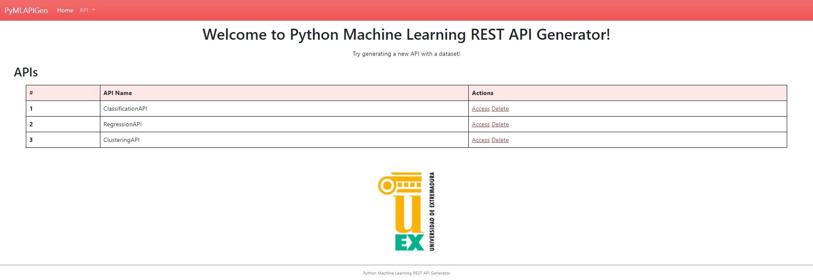
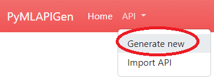

=========
Regresión
=========

En este apartado se mostrará un ejemplo de uso de la aplicación para **generar una API** con un experimento de **regresión**.

En el dominio de Machine Learning, la **regresión** es un tipo de aprendizaje **supervisado**. El valor que se quiere predecir
es un **valor numérico** (etiqueta) dentro de un **dominio continuo** a partir del resto de atributos.

Dataset
-------
El dataset que se va a utilizar para este ejemplo práctico consiste en un conjunto de datos de **propinas** de un restaurante.

Este dataset es **público** y tiene un formato **CSV**. Puede descargarlo :download:`pulsándo aqui <../../_static/tips.csv>`.

Las columnas de este dataset son las siguientes:

:total_bill: **Atributo** que indica la cuenta total de la comida. (*Float*)
:tip: **Etiqueta** a predecir. Representa la propina que da el cliente. (*Float*)
:sex: **Atributo** que indica el sexo del cliente. (*String*)
:smoker: **Atributo** que indica si el cliente fuma. (*String*)
:day:  **Atributo** que indica el día de la semana en el que tuvo lugar la comida. (*String*)
:time: **Atributo** que indica si la comida fue almuerzo o cena. (*String*)
:size: **Atributo** que indica el número de personas que conformaban el cliente. (*Integer*)

::

    "total_bill","tip","sex","smoker","day","time","size"
    16.99,1.01,"Female","No","Sun","Dinner",2
    10.34,1.66,"Male","No","Sun","Dinner",3
    21.01,3.5,"Male","No","Sun","Dinner",3
    23.68,3.31,"Male","No","Sun","Dinner",2
    ...

Generar API (Herramienta Web)
-----------------------------
En primer lugar, hay que inicializar la herramienta:

  - Si se instaló como paquete usando el comando ``pymlapigen``.
  - Si se clonó el repositorio con el comando ``python run.py``.

  ::

      * Serving Flask app 'pymlapigen' (lazy loading)
      * Environment: production
      * Debug mode: off
      * Running on http://127.0.0.1:5000/ (Press CTRL+C to quit)

Una vez inicializada la herramienta, acceder a ella a través del URL http://localhost:5000.

 

Dentro de la aplicación, para comenzar la generación de la API, desplegar el menú *API* y pulsar sobre *Generate New*.

Paso 1
^^^^^^
.. image:: _static/paso_1.png
   :align: center
   :alt: Paso 1 Regresión

En este paso, se debe escoger el **nombre de la API** a generar y el **dataset** del experimento.

Para este ejemplo, introduciremos en el formulario los siguientes valores:

:API Name: *RegressionAPI*
:Separator: *,*
:File: *Fichero descargado del apartado* `dataset <#dataset>`_

Una vez introducidos los parámetros, presionar el botón **Next**.

Paso 2
^^^^^^
.. image:: _static/paso_2_reg.png
   :align: center
   :alt: Paso 2 Regresión

En este paso, se debe escoger **que hacer** con los **valores que faltan** o **NaN** del dataset.

Como en el dataset de este ejemplo todos los valores **están** y son **válidos**, este paso es irrelevante.

Simplemente presionar el botón **Next**.

Paso 3
^^^^^^

En este paso, se debe escoger la **etiqueta** del dataset a partir del cual se entrenará el modelo para predecir en el experimento de regresión.

También se debe elegir el **algoritmo** de Machine Learning que llevará a cabo el modelo que se entrenará.

Para este ejemplo, introduciremos en el formulario los siguientes valores:

:Label: *tips*
:Algorithm: *Regression > Linear Regression*

Una vez introducidos los parámetros, presionar el botón **Next**.

Paso 4
^^^^^^

En este último paso, se deben seleccionar los **parámetros adicionales** del experimento.

Para este ejemplo, se dejarán las **opciones por defecto** y se presiona el botón **Finish** para comenzar la **generación de la API**.

Ventanas API (Herramienta Web)
------------------------------

Una vez se genere la API (entrenamiento y evaluación del modelo) se nos redirigirá a la ventana **HOME** de la API (http://localhost:5000/RegressionAPI).

.. image:: _static/home_reg.png
   :align: center
   :alt: Home API Regresión

En esta ventana podrás acceder a las distintas **rutas** y los diferentes **endpoints** de la API.

Además, en la **barra de navegación** podrás navegar entre las distintas ventanas de la API o salir de ella.

Dataset
^^^^^^^

(http://localhost:5000/RegressionAPI/dataset)

En esta ventana podrás **visualizar** el dataset del experimento de la API generada.

También puedes **ordenar** la tabla pulsando en las cabeceras y aplicar **filtros**.

Métricas
^^^^^^^^

(http://localhost:5000/RegressionAPI/metrics)

En esta ventana podrás **visualizar** las métricas del experimento de la API generada.

También puedes **desplegar** y **echar un vistazo** al resultado de la **fase de evaluación** del experimento. En él, puedes ver el **valor original** de la etiqueta, el **valor predicho** y el error cometido. 

Model
^^^^^

(http://localhost:5000/RegressionAPI/model)

En esta ventana podrás **visualizar** los parámetros escogidos para el experimento de la API generada.

Predecir
^^^^^^^^

.. image:: _static/predict_reg.png
   :align: center
   :alt: Predecir API Regresión

(http://localhost:5000/RegressionAPI/predict)

En esta ventana podrás realizar **predicciones** utilizando el modelo entrenado del experimento de la API generada.

Puedes realizar las predicciones de diversas formas:
   
   - Introduciendo los datos **manualmente**.
   - Utilizando un objeto **JSON** como parámetro de entrada.
   - A través de un fichero **CSV** de entrada.

Una vez introducidos los datos y pulsado el botón **Predict**, si los datos son correctos y no hay ningún problema, se nos mostrará abajo el resultado de la predicción.

**Por ejemplo**, mandar a predecir el siguiente objeto JSON:

::

   [{
        "total_bill": 24.08,
        "sex": "Female",
        "smoker": "No",
        "day": "Thur",
        "time": "Lunch",
        "size": 4
    }, {
        "total_bill": 20.45,
        "sex": "Male",
        "smoker": "No",
        "day": "Sat",
        "time": "Dinner",
        "size": 4
    }, {
        "total_bill": 13.42,
        "sex": "Male",
        "smoker": "Yes",
        "day": "Fri",
        "time": "Lunch",
        "size": 2
    }]

El resultado es el siguiente:

Gráficos
^^^^^^^^

(http://localhost:5000/RegressionAPI/graphs)

En esta ventana podrás **visualizar** distintos **gráficos** en función del modelo del experimento de la API generada.

Generar API (Petición JSON)
-----------------------------
Además de la aplicación web, es posible generar y utilizar la API a partir de **peticiones JSON** a los endpoints de la aplicación.

Petición JSON (/load)
^^^^^^^^^^^^^^^^^^^^^
Para generar una API equivalente al generado con la aplicación web, se debe enviar una petición **HTTP POST** al endpoint http://localhost:5000/api/load. El cuerpo de esta petición HTTP POST será :download:`este JSON<_static/regression_quickstart.json>`. 

Si todo funciona correctamente, se nos debería devolver el siguiente resultado de la operación:

::

    {
        "success": "The API has been successfully generated and its now operable.",
        "endpoints": {
            "home": {
                "methods": "GET",
                "endpoint": "/api/RegressionAPIFromJSON"
            },
            "dataset": {
                "methods": "GET",
                "endpoint": "/api/RegressionAPIFromJSON/dataset"
            },
            "metrics": {
                "methods": "GET",
                "endpoint": "/api/RegressionAPIFromJSON/metrics"
            },
            "model": {
                "methods": "GET",
                "endpoint": "/api/RegressionAPIFromJSON/model"
            },
            "predict": {
                "methods": "POST",
                "endpoint": "/api/RegressionAPIFromJSON/predict"
            }   
        }
    }

Endpoints API (Peticiones JSON)
-------------------------------

GET Dataset
^^^^^^^^^^^

**Endpoint:** http://localhost:5000/api/RegressionAPIFromJSON/dataset

En este endpoint podrás **consultar** el **dataset** del experimento de la API generada.

Resultado:

::

   [
      {
        "day": "Sun", 
        "sex": "Female", 
        "size": 2, 
        "smoker": "No", 
        "time": "Dinner", 
        "tip": 1.01, 
        "total_bill": 16.99
      }, 
      {
        "day": "Sun", 
        "sex": "Male", 
        "size": 3, 
        "smoker": "No", 
        "time": "Dinner", 
        "tip": 1.66, 
        "total_bill": 10.34
      },  
      ...   
      {
        "day": "Thur", 
        "sex": "Female", 
        "size": 2, 
        "smoker": "No", 
        "time": "Dinner", 
        "tip": 3.0, 
        "total_bill": 18.78
      }
   ]

GET Metrics
^^^^^^^^^^^

**Endpoint:** http://localhost:5000/api/RegressionAPIFromJSON/metrics

En este endpoint podrás **consultar** la **evaluación** del experimento de la API generada.

Resultado:

::

    {
        "MAE": 0.7171821289867383, 
        "MSE": 0.9318323215910987, 
        "RMSE": 0.9653146231105684, 
        "RMSLE": -0.03530119646931796, 
        "R2": 0.29309667441267395
    }

GET Model
^^^^^^^^^

**Endpoint:** http://localhost:5000/api/RegressionAPIFromJSON/model

En este endpoint podrás **consultar** los **parámetros del experimento** de la API generada.

Resultado:

::

    {
        "label": "tip", 
        "features": [
            "day", 
            "sex", 
            "size", 
            "smoker", 
            "time", 
            "total_bill"
        ], 
        "problem": "Regression", 
        "NanNull": "drop", 
        "dropped": [], 
        "algorithm": "LinearRegression", 
        "algorithm_args": {}, 
        "dataset_size": 244, 
        "training_size": 170, 
        "testing_size": 74
    }

POST Predict
^^^^^^^^^^^^^

**Endpoint:** http://localhost:5000/api/RegressionAPIFromJSON/predict

En este endpoint podrás realizar **predicciones** al experimento de la API generada.

Para ello, en el cuerpo de la petición HTTP POST se introducirá un objeto JSON con los parámetros de entrada.

Por ejemplo se va a mostrar una petición HTTP POST cuyo cuerpo es: 

::

   [{
        "total_bill": 24.08,
        "sex": "Female",
        "smoker": "No",
        "day": "Thur",
        "time": "Lunch",
        "size": 4
    }, {
        "total_bill": 20.45,
        "sex": "Male",
        "smoker": "No",
        "day": "Sat",
        "time": "Dinner",
        "size": 4
    }, {
        "total_bill": 13.42,
        "sex": "Male",
        "smoker": "Yes",
        "day": "Fri",
        "time": "Lunch",
        "size": 2
    }]

Resultado:

::

    [
        3.9641966337558423,
        3.612597488713627,
        2.413253138268394
    ]