========
Ventanas
========

En esta sección se comentarán las distintas **ventanas** que dispone la aplicación web.

Home
----

.. image:: ../_static/home.png
   :align: center
   :alt: Ventana Home

(http://localhost:5000/)

Esta es la **ventana principal** de la aplicación.

Dentro de ella podrás **consultar**, **acceder** y **eliminar** todas las APIs generadas e importadas. 

Además, se dispone de una **barra de navegación** a partir de la cual se puede acceder a:

- **Generar** una `nueva API <#generacion-de-api>`_.
- **Importar** una `API ya generada <#importar>`_.

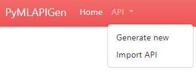

Generación de API
-----------------

.. image:: _static/paso1.png
   :align: center
   :alt: Generación API Aplicacion Web

(http://localhost:5000/load/0)

En esta ventana podrás **generar una nueva API** a través de un **experimento Machine Learning**.

Para más información acerca de las opciones de generación de APIs, consulta la sección :doc:`generation`.

API Home
--------

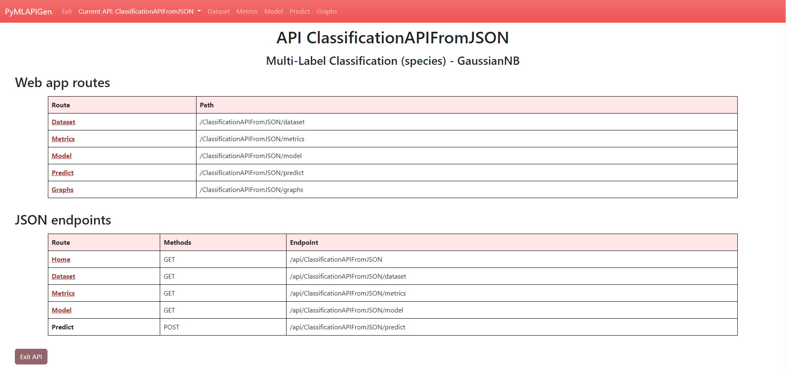

(http://localhost:5000/NOMBREAPI)

Esta es la **ventana principal** de la una API.

Dentro de ella podrás **consultar** y **acceder** a las distintas ventanas y endpoints de la **API generada**.

Además, se dispone de una **barra de navegación** a partir de la cual se puede acceder a:

- `Home principal <#home>` de la aplicación.
- Menú desplegable:
   - **Generar** una `nueva API <#generacion-de-api>`_.
   - **Importar** una `API ya generada <#importar>`_.
   - **Modificar** la `API <#modificar-api>`_.
   - **Eliminar** la API.
   - **Exportar** la API generada.
- `Dataset del experimento <#dataset>`_. 
- `Métricas del experimento <#metricas>`_. 
- `Modelo de la experimento <#modelo>`_. 
- `Predicciones <#predecir>`_. 
- `Gráficos de la experimento <#graficos>`_. 

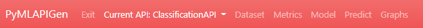

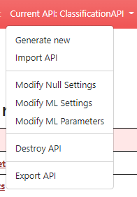

Dataset
--------

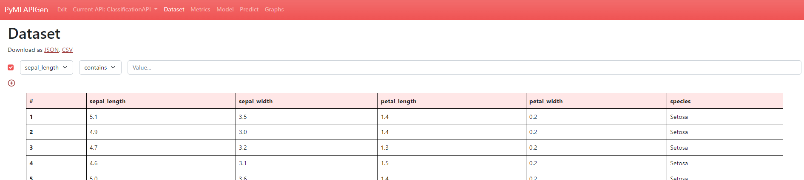

(http://localhost:5000/NOMBREAPI/dataset)

En esta ventana podrás **visualizar** el dataset del experimento de la API generada. Además, puedes descargar el dataset como **JSON** O **CSV**.

También puedes **ordenar** la tabla pulsando en las cabeceras y aplicar **filtros**. Puedes añadir y quitar filtros pulsando los botones "+" y "-".

Métricas
--------

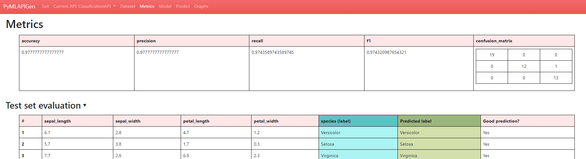

(http://localhost:5000/NOMBREAPI/metrics)

En esta ventana podrás **visualizar** las métricas del experimento de la API generada.

En experimentos de **clasificación** y **regresión**, puedes **desplegar** y **echar un vistazo** al resultado de la **fase de evaluación** del experimento. En él, puedes ver el **valor original** de la etiqueta/clase, el **valor predicho** y si es **correcto o no** (clasificación) o el **error** (regresión). 

En experimentos de **clustering**, en cambio, puedes visualizar el resultado de la **fase de asignación de conjuntos** del experimento. Podrás ver el **clúster** al cual se ha **asignado** cada entrada del dataset.

Modelo
------

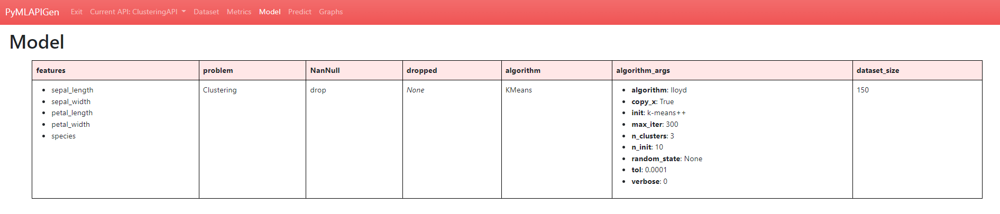

(http://localhost:5000/NOMBREAPI/model)

En esta ventana podrás **visualizar** los parámetros escogidos para el experimento de la API generada.

Predecir
--------

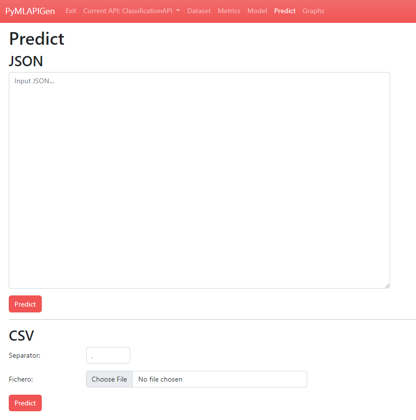

(http://localhost:5000/NOMBREAPI/predict)

En esta ventana podrás realizar **predicciones** utilizando el modelo entrenado del experimento de la API generada.

Puedes realizar las predicciones de diversas formas:
   
   - Introduciendo los datos **manualmente**.
   - Utilizando un objeto **JSON** como parámetro de entrada.
   - A través de un fichero **CSV** de entrada.

Una vez introducidos los datos y pulsado el botón **Predict**, si los datos son correctos y no hay ningún problema, se nos mostrará abajo el resultado de la predicción.

Gráficos
--------

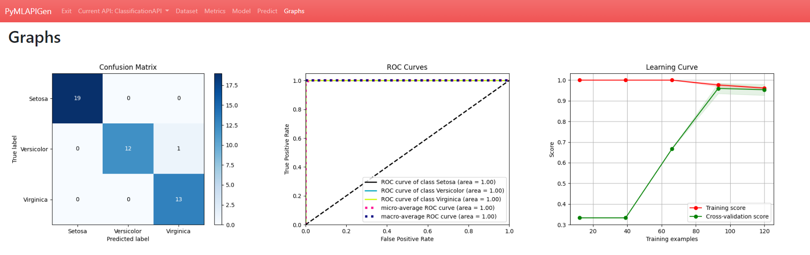

(http://localhost:5000/ClassificationAPI/graphs)

En esta ventana podrás **visualizar** distintos **gráficos** en función del modelo del experimento de la API generada.

Importar
--------

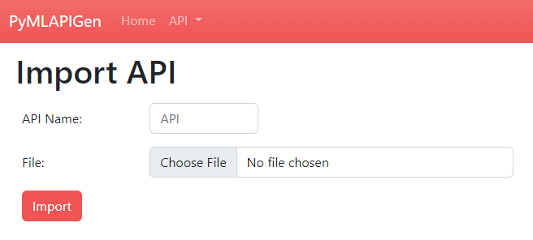

(http://localhost:5000/import)

En esta ventana podrás **importar una API** generada y exportada (extensión **.api**) previamente **sin necesidad de entrenar y evaluar el modelo de nuevo**.

Modificar API
-------------

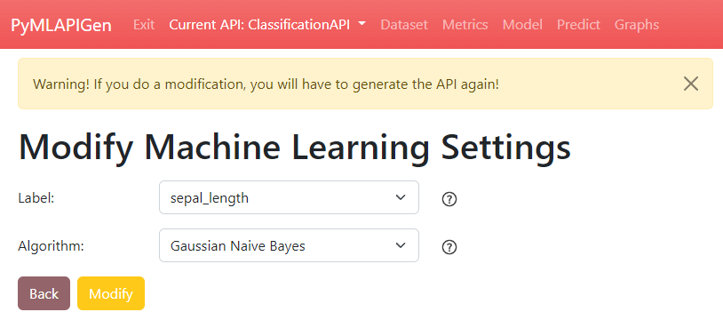

(http://localhost:5000/load/0)

En esta ventana podrás **modificar una API generada**.

Si realizas una modificación, tendrás que realizar de vuelta los **pasos posteriores** de la generación y volver a **generar la API** (incluyendo entrenamiento y evaluación).

Para más información acerca de las opciones de generación de APIs, consulta la sección :doc:`generation`.
